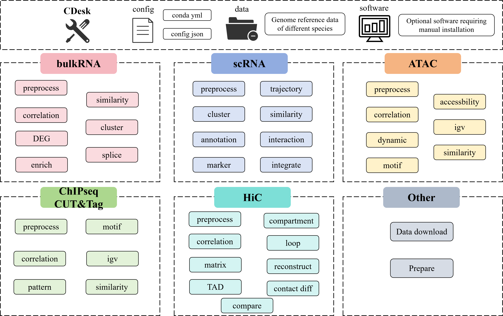

<div align="center">

# CDesk Multi-Omics Analysis Pipeline

📚 **Documentation**: [**User Guide**](https://jerry1gotobed.github.io/CDesk.github.io/CDesk.html)

</div>


CDesk is an integrated multi-omics analysis pipeline designed for processing data from various sequencing-based assays, including RNA-seq, scRNA-seq, ATAC-seq, CUT&Tag, ChIP-seq, and Hi-C. It comprises multiple subcommands that cover a comprehensive range of analysis tasks, from raw sequencing data process to downstream various advanced functions. Dedicated conda environment YAML files are supplied. To install, simply create the Conda environment from thess files (some functions may require additional software) and prepare the necessary species-specific data. Once configured, users can perform the desired analyses by entering the corresponding command on the command line.

<div align="center">


</div>

## Installation
### ** Download the scripts **
```
git clone https://github.com/jerry1gotobed/CDesk.git
```
### ** Prepare the Conda Environments **

- **Linux / macOS (or Windows with WSL)**: Use Conda/Mamba environments.
```
mamba env create -f CDesk.yml
mamba env create -f CDesk_py3.7.yml
mamba env create -f CDesk_py2.7.yml
mamba env create -f CDesk_R.yml
```
We provide Conda environments containing the required software, R, and Python dependencies used in the scripts (some tools may require additional manual installation). We recommend using mamba instead of conda for faster environment setup.
```
# Add execution permissions
chmod -R +x /path/to/your/CDesk
# Create a symbolic link to a system bin directory (requires sudo)
sudo ln -s /path/to/your/CDesk/CDesk /usr/local/bin/CDesk
# OR create a symbolic link to user local bin (no sudo)
mkdir -p ~/.local/bin
export PATH="$HOME/.local/bin:$PATH"
ln -s /path/to/your/CDesk/CDesk ~/.local/bin/CDesk
```

- **Windows**: Some software may not be installable via Conda on Windows. Therefore, we also provide a pre-built Docker image that contains the complete CDesk environment. You can download the Docker image archive from: https://doi.org/10.5281/zenodo.19709171.

After downloading cdesk-shared.tar, load and run the Docker container as follows:
```
# This takes time to load the large environment
docker load -i cdesk-shared.tar

# This may take a few minutes
docker run -it --name container_name \
  -v /path/to/your/CDesk:/CDesk \
  cdesk-shared:1.0 /bin/bash

# Add execution permissions
chmod -R +x /CDesk
```
Once inside the container, you are in the CDesk environment and can execute the analysis scripts directly.

### ** After installation, you should be able to run CDesk now **
```
CDesk -h

# It would show something like this
——————————————————————————————Load CDesk environment——————————————————————————————
Load CDesk from conda environment: /opt/conda/envs/CDesk
Load CDesk_py3.7 from conda environment: /opt/conda/envs/CDesk_py3.7
Load CDesk_py2.7 from conda environment: /opt/conda/envs/CDesk_py2.7
Load CDesk_R from conda environment: /opt/conda/envs/CDesk_R
——————————————————————————————CDesk environment ready——————————————————————————————
usage: CDesk [-h] {tools,bulkRNA,scRNA,ATAC,ChIPseqCUTTag,HiC} ...

CDesk multiomics pipeline

positional arguments:
  {tools,bulkRNA,scRNA,ATAC,ChIPseqCUTTag,HiC}
                        Choose an omic to run the script
    tools               Some other tools
    bulkRNA             bulkRNA-seq pipeline
    scRNA               scRNA pipeline
    ATAC                ATAC pipeline
    ChIPseqCUTTag       ChIPseq&CUTTag pipeline
    HiC                 HiC pipeline

options:
  -h, --help            show this help message and exit
```
Each time you run CDesk, it first checks for the presence of the required CDesk Conda or Mamba environments. You can also specify custom environment paths in the configuration file. If no Conda/Mamba environment is found, CDesk will fall back to your system's default environment. However, this may lead to compatibility issues if dependencies are missing or mismatched.

### ** Prepare the Data and Write the Configuration File **
   
You need to prepare reference data for the species of interest and specify the corresponding file paths in the config.json configuration file. This file stores paths to genomic data, annotation files, and any additional software installations.

An example configuration is provided below. You can customize it to support additional species or data types. Note that not all fields are required — the specific data and tools needed depend on the task you intend to run. CDesk will check for required resources and exit with an informative error message if any are missing.

<details>
<summary>
 An example of configuration file</summary>
<pre>
<blockcode>
{
  "software":{
    "cellranger":".../bin/cellranger",
    "DrSeq":".../bin/DrSeq",
    "dnbc4tools":".../dnbc4tools",
    "juicer_tools_jar":".../juicer_tools_1.22.01.jar",
    "dipc":".../dip-c",
    "hickit":".../hickit",
    "hickit_js":".../hickit.js",
    "celescope_path":".../celescope/bin"
  },
  "conda_env":{
    "CDesk":".../miniconda3/envs/CDesk",
    "CDesk_R":".../miniconda3/envs/CDesk_R",
    "CDesk_py3.7":".../miniconda3/envs/CDesk_py3.7",
    "CDesk_py2.7":".../miniconda3/envs/CDesk_py2.7"
  }, 
  "data":{
    "mm10": {
      "hisat2_index": ".../mm10/mm10",
      "refseq_gtf": ".../mm10/mm10.ncbiRefSeq.WithUCSC.gtf",
      "refseq_bed": ".../mm10/mm10.refseq.bed",
      "chromInfo": ".../mm10/mm10.len",
      "fasta": ".../mm10/mm10.fa",
      "tf_file": ".../mm10/Mus_musculus_TF.txt",
      "promoter_file": ".../mm10.promoter.ncbiRefSeq.WithUCSC.bed",
      "TE_idx": ".../mm10.exclusive.idx",
      "scRef10x": ".../mm10Self",
      "effective_genome_size": "mm",
      "gff3":".../mm10.gff3",
      "refgenes":".../mm10.refgenes.txt",
      "bowtie2_mapindex":".../mm10",
      "singleron_mapindex":"../mm10",
      "dnbc_mapindex":".../mm10"
    },
    "hg38": {
      "hisat2_index": ".../hg38/hg38",
      "refseq_gtf": ".../hg38.ncbiRefSeq.WithUCSC.gtf",
      "refseq_bed": ".../hg38.refseq.bed",
      "chromInfo": ".../hg38.len",
      "fasta": ".../hg38.fa",
      "tf_file": ".../Homo_sapiens_TF.txt",
      "promoter_file": ".../hg38.Promoter.bed",
      "TE_idx": ".../hg38.exclusive.idx",
      "scRef10x": ".../hg38",
      "effective_genome_size": "hs",
      "gff3":".../hg38.gff3",
      "refgenes":".../hg38.refgenes.txt",
      "bowtie2_mapindex":".../hg38",
      "singleron_mapindex":".../hg38",
      "dnbc_mapindex":".../hg38"
    }
  }
}

</blockcode>
- software: Saves the ptional software requiring manual installation
- conda_env: The conda environments path
- data: Saves the genome reference data of different species
    - hisat2_index: Genome index files for HISAT2 alignment
    - refseq_gtf: Gene annotation file in GTF format based on RefSeq
    - refseq_bed: BED-formatted gene annotation derived from RefSeq
    - chromInfo: Chromosome name and length information for the genome
    - fasta: Reference genome sequence in FASTA format
    - tf_file: List of transcription factors associated (https://guolab.wchscu.cn/AnimalTFDB#!/download)
    - promoter_file: BED file defining promoter regions of genes in the genome based on RefSeq annotation
    - TE_idx: Exclusive index for transposable elements (TEs) in the genome (https://github.com/JiekaiLab/scTE-1)
    - scRef10x: Reference dataset for single-cell RNA-seq analysis compatible with 10x Genomics pipelines
    - effective_genome_size: Effective genome size parameter 
    - gff3: Genome annotation in GFF3 format
    - refgenes: Custom gene annotation file (http://genome.ucsc.edu/cgi-bin/hgTables)
    - bowtie2_mapindex: Bowtie2 index files for short-read alignment to the reference genome
    - singleron_mapindex: Reference index directory for Singleron single-cell data analysis 
    - dnbc_mapindex: Genome index for DNBC4Tools pipeline
</pre>
</details>

<br>

We have provided pre-built reference configuration files for CDesk for mm10 and hg38, including refseq_bed, tf_file, promoter_file, TE_idx, and refgenes in Zenodo at https://doi.org/10.5281/zenodo.19709171.
