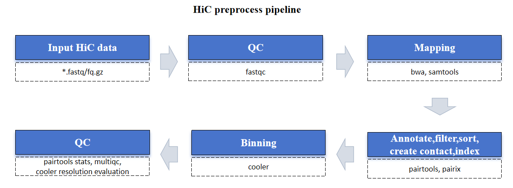

---
html:
    toc: true
---
# CDesk: 5. HiC pipeline{ignore}
Our CDesk HiC module comprises of 9 function submodules. Here we present you the CDesk HiC working pipeline and how to use it to analyze your HiC data. 
[toc]

## 5.1 HiC: Preprocess
The CDesk HiC preprocess pipeline is illustrated in the figure below. The input consists of a directory containing compressed FASTQ files in either paired-end format <u> (xxx_1.fastq.gz/xxx_1.fq.gz and xxx_2.fastq.gz/xxx_2.fq.gz)</u>  or single-end format <u> (xxx.fastq.gz/xxx.fq.gz)</u> .

The pipeline first trims adapter using Trim Galore and assesses sequencing quality using FastQC. Reads are then aligned to the reference genome using BWA and processed with Samtools. Following alignment, Pairtools and Pairix are employed to annotate, filter, sort, and generate indexed contact (.cool) files. Finally, the quality of the resulting .cool files is evaluated using pairtools stats, and their resolution is assessed to ensure data integrity.
<div align="center">



</div>

<center><i>CDesk HiC preprocess pipeline</i></center><br>

Here is an example about how to use the CDesk HiC preprocess module. 
```shell
CDesk HiC preprocess \
-i /.../input_directory -s susScr11 \
-o /.../output_directory 
```
|Parameters^(*necessary)^|Description|Default value|
|----|----|----|
|-i,--input*|The input directory|
|-o,--output*|The output directory|
|-s,--species*|The species specified|
|-t,--thread|The number of threads to use|10
|-f,--filter|Do stricter filtering, use parameters refering to Ruan's Lab|
|-l|1:Single sequencing, 2:Pair sequencing |2
|-r,--resolution|Specify the resolutions, separate by comma|10000,100000,1000000

If the pipeline runs successfully, you will see output similar to the figure shown below.
- Cool directory: Stores the generated HiC cool file.
- Pairs: Stores the HiC pair files.
- Pairsam: Stores the intermediate pairsam files.
- QC: Stores the fastqc result, resolution evaluation result, trim galore log and pairtools stats result.

<div align="center">

</div>
<center><i>CDesk HiC preprocess example result</i></center>

<details>
  <summary>A successful CDesk HiC preprocess running process</summary>
  <pre><blockcode>
Checking required tools...
All required tools are available.
--------------------------------------------INITIALIZING----------------------------------------------
HiC data analysis pipeline is now running...
Number of threads ---------- 100
Directory of data ---------- /mnt/linzejie/CDesk_test/data/5.HiC/1.preprocess
Directory of result ---------- /mnt/linzejie/CDesk_test/result/5.HiC/1.preprocess/default
Method of sequencing ---------- 2
Mapping index ---------- /mnt/zhaochengchen/Data/mm10/mm10.fa
ChromInfo ---------- /mnt/zhaochengchen/Data/mm10/mm10.len
---------------------------------------START ANALYZING-----------------------------------------
-----------------------------------------------------------------------------------------------------
----------------------------Number 1 sample: 2D5_13cycle_S99_L999--------------------------
-----------------------------------------------------------------------------------------------------
QC 2025-09-15 16:15:27 fastqc ...
paired data 2025-09-15 16:28:08 trim_galore ...
paired data 2025-09-15 16:35:02 mapping ...
paired data 2025-09-15 17:27:16 stats ...
cooler cload pairix 2025-09-15 17:56:40 binning ...
-----------------------------------------------------------------------------------------------------
----------------------------Number 2 sample: WT_13cycle_S99_L999--------------------------
-----------------------------------------------------------------------------------------------------
QC 2025-09-15 17:57:25 fastqc ...
paired data 2025-09-15 18:09:45 trim_galore ...
paired data 2025-09-15 18:16:10 mapping ...
paired data 2025-09-15 18:58:07 stats ...
cooler cload pairix 2025-09-15 19:27:00 binning ...
Finished, you can check the results now
</blockcode></pre>
</details>
<details>
<summary>
Example Resolution_evaluation.txt</summary>
<pre>
========== E250818003_L01_H250701706A.100k.cool ==========
Resolutions: 100000bp
Total bins: 24848
Total pixels: 86906850
Total contacts: 421662082
Bins contact > 1000: 24236
Proportion of bin contact > 1000: 97.54%
Average bin contact: 16969.66
Average pixel contact: 4.85
Max bin contact: 84497
Min bin contact: 1<br>
========== E250818003_L01_H250701706A.10k.cool ==========
Resolutions: 10000bp
Total bins: 243816
Total pixels: 191696405
Total contacts: 421662082
Bins contact > 1000: 219827
Proportion of bin contact > 1000: 90.16%
Average bin contact: 1729.43
Average pixel contact: 2.20
Max bin contact: 52547
Min bin contact: 1<br>
========== E250818003_L01_H250701706A.1M.cool ==========
Resolutions: 1000000bp
Total bins: 2874
Total pixels: 3270304
Total contacts: 421662082
Bins contact > 1000: 2531
Proportion of bin contact > 1000: 88.07%
Average bin contact: 146716.10
Average pixel contact: 128.94
Max bin contact: 299153
Min bin contact: 1<br>
========== E250822001_L01_H250701706A.100k.cool ==========
Resolutions: 100000bp
Total bins: 24707
Total pixels: 9099630
Total contacts: 25709991
Bins contact > 1000: 13630
Proportion of bin contact > 1000: 55.17%
Average bin contact: 1040.60
Average pixel contact: 2.83
Max bin contact: 6782
Min bin contact: 1<br>
========== E250822001_L01_H250701706A.10k.cool ==========
Resolutions: 10000bp
Total bins: 242229
Total pixels: 14304799
Total contacts: 25709991
Bins contact > 1000: 13
Proportion of bin contact > 1000: 0.01%
Average bin contact: 106.14
Average pixel contact: 1.80
Max bin contact: 5035
Min bin contact: 1<br>
========== E250822001_L01_H250701706A.1M.cool ==========
Resolutions: 1000000bp
Total bins: 2775
Total pixels: 2382515
Total contacts: 25709991
Bins contact > 1000: 2446
Proportion of bin contact > 1000: 88.14%
Average bin contact: 9264.86
Average pixel contact: 10.79
Max bin contact: 18672
Min bin contact: 1
</pre>
</details>

## 5.2 HiC: Correlation
The CDesk HiC correlation module extracts the observed/expected (O/E) interaction matrices from common genomic regions across input Hi-C samples and compares them by performing correlation and principal component analysis (PCA).

Here is an example about how to use the CDesk HiC correlation module. 
```shell
CDesk HiC correlation -i /.../input.csv -o /.../output --chr chr15 (--inter_chrom)
```
|Parameters^(*necessary)^|Description|Default value|
|----|----|----|
|-i,--input*|The input hic sample information file|
|-o,--output*|The output directory|
|--chr|Specify the chromosome|No
|--inter_chrom|Whether to include inter-chrom signals|
|--width|Plot width|8
|--height|Plot height|6

[FAN-C](https://fan-c.readthedocs.io/en/latest/index.html) is employed to generate observed/expected (O/E) matrices from Hi-C data, which is fully compatible with Cooler files (.cool, .mcool) and Juicer files (.hic). Accordingly, every Hi-C file specified in the input CSV must be in one of these FAN-C–compatible formats.

If the pipeline runs successfully, there would be a correlation heatmap pdf file, a PCA plot pdf file and a tmp directory that stores intermediate O/E matrix in the output directory.

<div align="center">


</div>
<center><i>CDesk HiC correlation example result</i></center>
<details>
  <summary>A successful CDesk HiC correlation running process</summary>
<pre><blockcode>
>>>2025-09-09 13:13:39 Extract O/E matrix
>>>2025-09-09 14:09:57 O/E matrix extraction done
>>>2025-09-09 14:09:57 Correlation analysis and plot
Done, you can see the result now
</blockcode></pre>
</details>
<details>
<summary>
What should the input.csv file look like?</summary>
<pre>
(2 columns:file,tag)
input.csv:
file,tag
/mnt/linzejie/CDesk_test/data/5.HiC/test_matrix/Hi-C_8-cell.100k.cool,8-cell
/mnt/linzejie/CDesk_test/data/5.HiC/test_matrix/Hi-C_ICM.100k.cool,ICM
/mnt/linzejie/CDesk_test/data/5.HiC/test_matrix/Hi-C_early_2-cell.100k.cool,2cell
/mnt/linzejie/CDesk_test/data/5.HiC/test_matrix/Hi-C_late_2-cell.100000N.mcool,2cell
</pre>
</details>

## 5.3 HiC: Matrix
The CDesk Hi-C matrix module enables format conversion and matrix normalization for Hi-C data. As illustrated in the figure below, the pipeline supports multiple input formats, including h5, cool, mcool, Juicer hic, FAN-C hic, and pairs, and can export results to h5, cool, mcool, Juicer hic, and FAN-C hic formats. By default, h5 files are first converted to cool format using [hicConvertFormat](https://hicexplorer.readthedocs.io/en/stable/content/tools/hicConvertFormat.html), while all other input formats are transformed into FAN-C-compatible hic files for streamlined processing with the FAN-C toolkit. FAN-C generates an intermediate cool file, which can be further processed—either zoomified to higher resolutions using [cooler](https://cooler.readthedocs.io/en/latest/index.html) or converted to h5 format via hicConvertFormat. Finally, the resulting mcool file can be converted to Juicer hic format using the [Juicer tools](https://aidenlab.org/documentation.html), enabling compatibility with a wide range of downstream analysis platforms. During format conversion, users can choose the available matrix normalization method.
<div align="center">


</div>
<center><i>CDesk HiC matrix pipeline</i></center><br>

Here is an example about how to use the CDesk HiC matrix module. 
```shell
CDesk HiC matrix \
-i /.../Hi-C_ICM.sort.pairs.gz \ 
-o /.../pairs_to_juicerhic \
--inputFormat pairs --outputFormat juicerhic \
--oe 300000 --sparse 300000 -t 50 -n VC \
-r 300000,400000 --species mm10
```
|Parameters^(*necessary)^|Description|Default value|
|----|----|----|
|-i,--input*|The input hic file|
|-o,--output*|The output directory|
|--inputFormat*|The input format|{pairs,cool,mcool,juicerhic,fanchic,h5}
|--outputFormat*|The output format|{cool,mcool,juicerhic,fanchic,h5}
|-t,--thread|Number of threads|10
|-r,--resolution|The output resolution (must be divisible by the smallest resolution)|
|-n,--norm|The normalization method|None {KR,ICE,VC,VC-SQRT,None}
|--oe|The resolution of O/E matrix to extract (must be divisible by the smallest resolution)|
|--sparse|The resolution of sparse matrix to extract (must be divisible by the smallest resolution)|
|-s,--species|The specified species(needed while converted to juicer hic)|

If the pipeline runs successfully, there would be a result hic file with the format users specified and O/E or sparse matrix if users specifed with intermediate files in the tmp directory.
<div align="center">

</div>
<center><i>CDesk HiC matrix example result</i></center>

## 5.4 HiC: TAD
CDesk HiC TAD submodule utilizes the FAN-C toolkit to compute chromatin insulation scores and analyze directionalities. By calculating insulation scores and directionality indices, the module identifies TAD boundaries and extracts topologically associating domains (TADs). It further characterizes insulation and directionality distribution patterns around TAD boundaries and performs pairwise TAD comparisons using the TADCompare R package based on contact matrices. The module generates a comprehensive set of visual outputs, including boundary annotation files, insulation and directionality profile plots, TAD aggregate plots, and comparative analysis results.

Here is an example about how to use the CDesk HiC TAD module. 
```shell
CDesk HiC TAD -i  /.../input.csv \
-o /.../tad_output \
--insulation_window 10000000 --directionality_window 10000000 --expand 10000000
```
|Parameters^(*necessary)^|Description|Default value|
|----|----|----|
|-i,--input*|The input hic sample information file|
|-o,--output*|The output directory|
|--insulation_window|Window sizes to calculate insulation score in base pair|1000000
|--directionality_window|Window sizes to calculate directionality index in base pair|1000000
|--expand|Window sizes of boundary expansion in base pairs to calulate insulation score and DI near/on boundary|1000000

If the pipeline runs successfully, there would be 4 folders in the output directory. Folder contact saves the contact matrix of each chromosome of each hic sample. Folder img saves the insulation and directionality profile plots, TAD aggregate plot and tad compare result plot. Folder insulation_boundary_di saves the insulation score, directionality and boundary analysis result. Folder tad saves the recognized tad regions and tad strength of each hic sample and the tad compare result.

<div align="center">

</div>
<center><i>CDesk HiC tad example result</i></center>
<div align="center">

</div>
<center><i>direction_distance2boundary and insulation_distance2boundary example plot</i></center>

<div align="center">

</div>
<center><i>Tad aggregate example plot</i></center>

<div align="center">

</div>
<center><i>Tad compare example plot</i></center>


<details>
  <summary>A successful CDesk HiC tad running process</summary>
<pre><blockcode>
>>>2025-09-08 15:06:44 Calculate 18003 insulation score
>>>2025-09-08 15:27:02 18003 Insulation score calculation done
>>>2025-09-08 15:27:02 Analyze 18003 boundaries
>>>2025-09-08 15:27:05 18003 Boundaries analysis done
>>>2025-09-08 15:27:05 Calculate 18003 directionality index
>>>2025-09-08 15:36:48 18003 Directionality index calculation done
>>>2025-09-08 15:36:48 Get 18003 contact matrix of each chromosom
>>>2025-09-08 15:46:30 18003 contact matrix extraction done
>>>2025-09-08 15:46:30 Aggregate tad for 18003 
>>>2025-09-08 16:06:07 18003 Tad aggregate finished
>>>2025-09-08 16:06:07 18003 Sample finished
>>>2025-09-08 16:06:07 Calculate 22001 insulation score
>>>2025-09-08 16:25:39 22001 Insulation score calculation done
>>>2025-09-08 16:25:39 Analyze 22001 boundaries
>>>2025-09-08 16:25:42 22001 Boundaries analysis done
>>>2025-09-08 16:25:42 Calculate 22001 directionality index
>>>2025-09-08 16:34:47 22001 Directionality index calculation done
>>>2025-09-08 16:34:47 Get 22001 contact matrix of each chromosom
>>>2025-09-08 16:43:53 22001 contact matrix extraction done
>>>2025-09-08 16:43:53 Aggregate tad for 22001 
>>>2025-09-08 17:02:34 22001 Tad aggregate finished
>>>2025-09-08 17:02:34 22001 Sample finished
>>>2025-09-08 17:02:34 Tad compare
>>>2025-09-08 17:02:44 Tad compare finished
>>>2025-09-08 17:02:44 Finished, you can check the results now
</blockcode></pre>
</details>
<details>
<summary>
What should the input.csv file look like?</summary>
<pre>
(2 columns:file,tag)
input.csv:
file,tag
/mnt/linzejie/work/HiC_20250903/Cool/E250818003_L01_H250701706A.1M.cool,18003
/mnt/linzejie/work/HiC_20250903/Cool/E250822001_L01_H250701706A.1M.cool,22001
</pre>
</details>

## 5.5 HiC: Compartment
CDesk HiC compartment submodule utilizes the [cooltools](https://cooltools.readthedocs.io/en/latest/) toolkit to compute chromatin insulation scores and analyze directionalities.The process begins by extracting the contact matrix from hic data, followed by eigen decomposition using GC content as a phasing track to obtain the first eigenvector representing compartment features. The eigenvector is then used to stratify genomic regions and generate aggregate tad plots and saddle plots that visually capture the specific interaction patterns between active compartments (A-A) and inactive compartments (B-B). Finally, compartmentalization strength is quantified by calculating the saddle strength, which measures the enhancement ratio of A-A and B-B interactions relative to A-B interactions.

Here is an example about how to use the CDesk HiC compartment module. 
```shell
CDesk HiC compartment -i /.../test.csv \
-o /.../output_dir -r 1000000 -s susScr11
```
|Parameters^(*necessary)^|Description|Default value|
|----|----|----|
|-i,--input*|The input hic sample information file|
|-o,--output*|The output directory|
|-r,--resolution*|Resolution to specify|
|-t,--thread|Number of threads|20
|--GC|The GC file to provide|no
|-s,--species|The species, need to specify if no GC file provided|no
|--width|Plot width|10
|--height|Plot height|8

If the pipeline runs successfully, there would be 6 folders in the output directory. Folder cool saves the balanced cool files. Folder tmp saves the bin interval and speculated GC content file if no GC file provided. Folder expected_cis saves the eigenvectors and corresponding eigenvalues of the eigen value decomposition result.Folder interaction saves the the matrix of total contacts summed between genome segments grouped by E1 values (s_matrix) and the matrix of region-pair counts for each of those groups (c_matrix) of each hic sample. Folder AB stores the AB compartment and compartment strength of each hic sample. Folder img saves the saddle plot of each sample, AB compartment and compartment strength of all hic samples.

<div align="center">

</div>
<center><i>CDesk HiC compartment example result</i></center>

<div align="center">

</div>
<center><i>Compartment strength and transition example plot</i></center>

<div align="center">

</div>
<center><i>Saddle plot example</i></center>
<div align="center">

</div>
<center><i>AB compartment transition example plot</i></center>


<details>
  <summary>A successful CDesk HiC compartment running process</summary>
<pre><blockcode>
>>>2025-09-08 14:57:31 Analyze /mnt/linzejie/work/HiC_20250903/Cool/E250818003_L01_H250701706A.1M.cool
>>>2025-09-08 14:57:31 Balance the matrix
>>>2025-09-08 14:58:08 Matrix balance done
>>>2025-09-08 14:58:08 Compartment analysis
>>>2025-09-08 14:58:48 Compartment analysis done
>>>2025-09-08 14:58:48 Saddle plot
/mnt/linzejie/miniconda3/envs/CDesk_py3.7/lib/python3.7/site-packages/cooltools/api/saddle.py:89: RuntimeWarning: invalid value encountered in true_divide
  return obs_mat / exp_mat
cbar
________________________________________________________________________________
>>>2025-09-08 14:59:15 Analyze /mnt/linzejie/work/HiC_20250903/Cool/E250822001_L01_H250701706A.1M.cool
>>>2025-09-08 14:59:15 Balance the matrix
>>>2025-09-08 14:59:33 Matrix balance done
>>>2025-09-08 14:59:33 Compartment analysis
>>>2025-09-08 15:00:15 Compartment analysis done
>>>2025-09-08 15:00:15 Saddle plot
/mnt/linzejie/miniconda3/envs/CDesk_py3.7/lib/python3.7/site-packages/cooltools/api/saddle.py:89: RuntimeWarning: invalid value encountered in true_divide
  return obs_mat / exp_mat
cbar
>>>2025-09-08 15:00:33 Compute the compartment strength and analyze A/B transit for all samples
>>>2025-09-08 15:00:42 Done, you can check the results now
</blockcode></pre>
</details>
<details>
<summary>
What should the input.csv file look like?</summary>
<pre>
(2 columns:file,tag)
input.csv:
file,tag
/mnt/linzejie/work/HiC_20250903/Cool/E250818003_L01_H250701706A.1M.cool,18003
/mnt/linzejie/work/HiC_20250903/Cool/E250822001_L01_H250701706A.1M.cool,22001
</pre>
</details>

## 5.6 HiC: Loop
CDesk HiC loop submodule utilizes the FAN-C toolkit to call loops in Hi-C matrices using the HICCUPS algorithm. First, pixels are annotated with various metrics reflecting their loop probability using the HICCUPS algorithm. Next, candidate loops are filtered according to the criteria established by [Rao, Huntley et al.](https://linkinghub.elsevier.com/retrieve/pii/S0092867414014974): a peak is retained only if it shows at least a 2-fold enrichment over either the donut or lower-left neighborhood, at least a 1.5-fold enrichment over both the horizontal and vertical neighborhoods, and at least a 1.75-fold enrichment over both the donut and lower-left neighborhoods, with an FDR ≤ 0.1 in all neighborhood comparisons. Finally, aggregate loop plot is made, and loop strength is quantified as the average observed/expected (O/E) signal across the loop regions.

Here is an example about how to use the CDesk HiC loop module.
```shell
CDesk HiC loop -i /.../hicfile \
-o /.../output_dir -t 10
```
|Parameters^(*necessary)^|Description|Default value|
|----|----|----|
|-i,--input*|FanC supported hic input file|
|-o,--output*|The output directory|
|-t,--thread|Number of threads|10

If the pipeline runs successfully, there would be loop and loop arc bed files, a loop aggregate plot, a loop strength bed file and a tmp folder that saves intermediate files in the output directory.
<div align="center">

</div>
<center><i>CDesk loop example result</i></center>

<div align="center">

</div>
<center><i>Loop aggregate plot example</i></center>

<details>
  <summary>A successful CDesk HiC loop running process</summary>
<pre><blockcode>
>>>2025-09-09 09:08:35 Annotate pixels for loop calling
>>>2025-09-09 09:39:54 Annotation done
>>>2025-09-09 09:39:54 Filter annotated pixels
>>>2025-09-09 09:45:25 Annotation done
>>>2025-09-09 09:45:25 Merge unfiltered pixels into loops
>>>2025-09-09 10:19:25 Filtration done
>>>2025-09-09 10:19:25 Export to BEDPE
>>>2025-09-09 10:24:31 Exportion done
>>>2025-09-09 10:24:31 Loop aggregate plot
Expected 100% (2382515 of 2382515) |#######################################################################| Elapsed Time: 0:09:08 Time:  0:09:08
Matrices 100% (1082 of 1082) |#############################################################################| Elapsed Time: 0:00:13 Time:  0:00:13
>>>2025-09-09 10:43:13 Loop aggregate plot done
>>>2025-09-09 10:43:13 Grab O/E matrix and calculate loop strength
>>>2025-09-09 11:10:22 O/E matrix extraction and loop strength calculation done
>>>2025-09-09 11:10:22 Done, you can check the results now
Closing remaining open files:H6W3AW...done/mnt/linzejie/work/HiC_20250903/7.loop/tmp/E250822001_L01_H250701706A.1M_filtered.loops...done
</blockcode></pre>
</details>

## 5.7 HiC: 3D reconstruction
CDesk HiC reconstruct submodule utilizes [FLAMINGOrLite](https://github.com/JiaxinYangJX/FLAMINGOrLite) or [Hickit](https://github.com/lh3/hickit) to make 3D reconstruction from hic files. FLAMINGO takes cell-type specific distance matrices generated by Hi-C as inputs. By applying the low-rank matrix completion method on the observed distance matrices, an accurate prediction of 3D coordinates of DNA fragments is made. Hickit is a set of tools initially developed to process diploid single-cell Hi-C data. It extracts contact pairs from read alignment, identifies phases of contacts overlapping with SNPs of known phases, imputes missing phases, infers the 3D structure of a single cell and visualizes the structure. 

Here is an example about how to use the CDesk HiC reconstruct module.
```shell
CDesk HiC reconstruct flamingo -i /.../test.hic \
-o /.../output_dir --chr chr1 --domain_res 4e6 --frag_res 2e6

CDesk HiC reconstruct hickit --r1 /.../r1.fq.gz --r2 /.../r2.fq.gz \
--species susScr11 --prefix nophase -t 100 \
-o /.../output_dir
```
|Parameters^(*necessary)^|Description|Default value|
|----|----|----|
|flamingo
|-i,--input*|The input hic input file (juicer .hic file)|
|-o,--output*|The output directory|
|--chr*|Specify the chromosome|
|--domain_res*|The domain resolution|
|--frag_res*|The fragment resolution|
|--norm|The normalization method|None
|-t,--thread|Number of threads|10
|hickit
|--r1*|The hic read1 fastq compression file|
|--r2*|The hic read2 fastq compression file|
|-o,--output*|The output directory|
|--species*|Specify the species|
|--prefix|Output prefix|result
|--vcf|The SNP vcf compression file|
|--mat|The maternal sample|
|--pat|The paternal sample
|-t,--thread|Number of threads|20

If the flamingo pipeline runs successfully, there would be a vtk output file and temp files in the output folder. If the hickit pipeline runs successfully, there would be temp files and a result cif file in the output folder. 
<div align="center">

</div>
<center><i>CDesk HiC flamingo reconstruct example result</i></center>

<div align="center">

</div>
<center><i>CDesk HiC hickit reconstruct example result</i></center>

<details>
  <summary>A successful CDesk HiC flamingo reconstruct running process</summary>
<pre><blockcode>
[1] "./temp2025-09-14 15:57:19.511017"
[1] "Preparing data..."
[1] "Finshed time:  0  mins"
[1] "Dividing domains..."
[1] "Writing out temp files..."
[1] "Finshed time:  0  mins"
[1] "Reconstructing backbones..."
[1] "Finshed time:  0.21  mins"
[1] "Reconstructing intra-domain structures..."
[1] "Finshed time:  0.04  mins"
[1] "Assembling structures..."
[1] "Reading substructures..."
[1] "Finshed time:  0.04  mins"
[1] "Reconstruction sucessfully! Finshed time:  0.3  mins"
Done, you can see the result now
</blockcode></pre>
</details>
<details>
  <summary>A successful CDesk HiC hickit reconstruct running process</summary>
<pre><blockcode>
Checking required tools...
All required tools are available.
[Step 1] Extracting and filtering informative SNPs...
No VCF detected, skip this step
[Step 2] Mapping Hi-C data to reference genome...
[INFO] 20 patterns loaded from file
[Step 3] Phasing and generating contact pairs...
[M::hk_map_read] read 46017426 segments
[M::hk_seg2pair] generated 23070704 pairs
[M::hk_pair_dedup] duplicate rate: 1.03% = 238403 / 23070704
[M::main] Version: r291
[M::main] CMD: /mnt/linzejie/software/hickit-0.1.1_x64-linux/hickit -i /mnt/linzejie/work/HiC_20250903/7.Reconstruct/hickit/nophase.contacts.seg.gz -o -
[M::main] CPU time: 31.173 sec
[Step 4] 3D genome reconstruction (1M resolution)...
[Step 5] Post-processing and visualization...
input: distance unit = 0.0368012
[M::exp] read a 3D structure with 2392 particles at 1000000 bp resolution
extract chr1, chain "chr1"
extract chr10, chain "chr10"
extract chr11, chain "chr11"
extract chr12, chain "chr12"
extract chr13, chain "chr13"
extract chr14, chain "chr14"
extract chr15, chain "chr15"
extract chr16, chain "chr16"
extract chr17, chain "chr17"
extract chr18, chain "chr18"
extract chr2, chain "chr2"
extract chr3, chain "chr3"
extract chr4, chain "chr4"
extract chr5, chain "chr5"
extract chr6, chain "chr6"
extract chr7, chain "chr7"
extract chr8, chain "chr8"
extract chr9, chain "chr9"
extract chrX, chain "chrX"
translate [-0.030418125109851646,0.01182732969692557,0.0030241641511843803], object=chr1, camera=0
translate [0.007728062290969451,-0.005845266304344232,-0.008568354096990763], object=chr10, camera=0
translate [0.005328299495152011,0.004276068863514393,-0.009983505995724881], object=chr11, camera=0
translate [-0.009966183150827312,-0.004126515252450558,-0.022567192806668357], object=chr12, camera=0
translate [0.006404957357859509,0.018615023829436472,0.02432119878762458], object=chr13, camera=0
translate [-0.018694566612893038,0.003849567437237633,-0.0042180090265683395], object=chr14, camera=0
translate [0.0037866933468688746,0.00923500295031321,0.02391128876015207], object=chr15, camera=0
translate [0.02126949870401007,-0.01065764347825815,-0.012087666596990829], object=chr16, camera=0
translate [0.008717331442105847,-0.013952966097304564,-0.013165639811276483], object=chr17, camera=0
translate [0.012352861204012688,-0.0060571327639724615,-0.008311657668419348], object=chr18, camera=0
translate [-0.0019105993223043072,0.005295989416480795,-0.002004498833832788], object=chr2, camera=0
translate [-0.0018686134200467386,0.002531134153322512,-0.008837940563156274], object=chr3, camera=0
translate [-0.004645473719651294,-0.00689588794390561,-0.011403064020654816], object=chr4, camera=0
translate [0.009189836204012813,-0.021603061335399465,-0.004743611239847859], object=chr5, camera=0
translate [0.0007315169057617865,-0.001549936022117837,-0.001666599711025854], object=chr6, camera=0
translate [0.008620449318765377,-0.014823803724158147,0.006014244263665008], object=chr7, camera=0
translate [0.015660034765162756,-0.004751681068184466,-0.012283965607782249], object=chr8, camera=0
translate [-0.0053289780817056265,0.002313252950312261,0.00944190304586641], object=chr9, camera=0
translate [0.027167736204010806,-0.016823204192540908,-0.0014778302874669386], object=chrX, camera=0
mview store, object=chr1
mview store, object=chr10
mview store, object=chr11
mview store, object=chr12
mview store, object=chr13
mview store, object=chr14
mview store, object=chr15
mview store, object=chr16
mview store, object=chr17
mview store, object=chr18
mview store, object=chr2
mview store, object=chr3
mview store, object=chr4
mview store, object=chr5
mview store, object=chr6
mview store, object=chr7
mview store, object=chr8
mview store, object=chr9
mview store, object=chrX
[M::exp] writing output for 2392 particles
[M::__main__] command: /mnt/zhaochengchen/Work/OTHER/4.KJQ/2.HiC-Pro/4.hickit/dip-c/dip-c exp /mnt/linzejie/work/HiC_20250903/7.Reconstruct/hickit/nophase.mb.1m.3dg
[M::__main__] finished in 6.3 sec
[M::vis] read a 3D structure with 2392 particles at 1000000 bp resolution
[M::__main__] command: /mnt/zhaochengchen/Work/OTHER/4.KJQ/2.HiC-Pro/4.hickit/dip-c/dip-c vis /mnt/linzejie/work/HiC_20250903/7.Reconstruct/hickit/nophase.mb.1m.dip-c.clean.exp.3dg
[M::__main__] finished in 0.5 sec
Pipeline finished! Main result file: /mnt/linzejie/work/HiC_20250903/7.Reconstruct/hickit/nophase.mb.1m.dip-c.clean.exp.cif
</blockcode></pre>
</details>

## 5.8 HiC: Distance-contact
CDesk HiC pss(probability vs distance) submodule analyzes and compares chromatin contact frequencies (contact probability) across multiple samples at different genomic distances, and evaluates deviations from the "expected background" decay model. It grabs the contact matrix from  Hi-C data, compute the distance-contact count table (dist-contact table), performs normalization for each sample, and generates five types of visualizations to: compare overall contact decay trends among samples, assess deviations of observed contacts from the distance-dependent decay model, visualize the distribution patterns of these deviations across different distance ranges.

Here is an example about how to use the CDesk HiC pss module.
```shell
CDesk HiC pss -i /../input.csv -o /../output_dir
```
|Parameters^(*necessary)^|Description|Default value|
|----|----|----|
|-i,--input*|The input hic sample information file|
|-o,--output*|The output directory|
|--bin|Bins divided between each order of magnitude|20
|--curve_mean_min|The lower bound of the mean of the curve|1e-6
|--curve_bin_min|The lower bound of bin index of the curve|0
|--curve_x_min|The minimal X-axis truncation value of the curve|4
|--curve_x_max|The maximal X-axis truncation value of the curve|8
|--curve_y_bias|The Y-axis offset when plotting the difference from the expectation curve|-4
|--expcurve_x_min|The minimal X-axis drop value when plotting the difference from the expectation curve|5
|--expcurve_x_max|The maximal X-axis drop value when plotting the difference from the expectation curve|8
|--heatmap_x_min|The minimal X-axis truncation value of the heatmap|4.8
|--heatmap_x_max|The maximal X-axis truncation value of the heatmap|7.5
|width|Plot width|10
|height|Plot height|6

If the pss pipeline runs successfully, there would be 5 figures (figure 1: Global Contact Probability Curve, figure 2: Curve of Absolute Difference Between Observed and Expected Contacts, figure 3: Curve of Deviation Ratio Between Observed and Expected Contacts, figure 4: Heatmap of Absolute Differences, figure 5: Heatmap of Deviation Ratios) and contact matrix, contact-dist matrix in tmp folder in the output folder.

<div align="center">

</div>
<center><i>CDesk HiC pss example result</i></center>

<div align="center">

</div>
<center><i>Global Contact Probability Curve example</i></center>

<div align="center">

</div>
<center><i>Example Curve of Absolute Difference Between Observed and Expected Contacts</i></center>

<div align="center">

</div>
<center><i>Example Curve of Deviation Ratio Between Observed and Expected Contacts</i></center>

<div align="center">

</div>
<center><i>Example Heatmap of Absolute Differences</i></center>

<div align="center">

</div>
<center><i>Example Heatmap of Deviation Ratios</i></center>


<details>
  <summary>A successful CDesk HiC pss running process</summary>
<pre><blockcode>
>>>2025-09-14 16:53:08 Extract contact matrix
>>>2025-09-14 18:08:52 Contact matrix extraction done
>>>2025-09-14 18:08:52 Compute distance_contact
>>>2025-09-14 18:09:03 Distance_contact computation done
>>>2025-09-14 18:09:03 Plot PSS
>>>2025-09-14 18:09:06 PSS plot done
Finished, you can check the results now
</blockcode></pre>
</details>
<details>
<summary>
What should the input.csv file look like?</summary>
<pre>
(2 columns:file,tag)
input.csv:
file,tag
/mnt/linzejie/work/HiC_20250903/Cool/E250818003_L01_H250701706A.100k.cool,18003
/mnt/linzejie/work/HiC_20250903/Cool/E250822001_L01_H250701706A.100k.cool,22001
</pre>
</details>

## 5.9 HiC: Contact compare
CDesk HiC compare submodule utilizes [HiCcompare](https://www.bioconductor.org/packages/release/bioc/vignettes/HiCcompare/inst/doc/HiCcompare-vignette.html) R package to do differential contact analysis between 2 hic files. First, the pipeline reads the .hic file and extracts the contact matrix. Second, it constructs a hic.table object from the sparse upper-triangular Hi-C matrix. Third, it performs joint LOESS normalization on the two Hi-C datasets to remove technical biases and enable cross-sample comparison. Subsequently, it identifies significant differences between the jointly normalized datasets. Next, it generates an MD plot (mean-difference plot) for visualization of differential interactions. Finally, it extracts the observed/expected (O/E) matrix and produces a triangle heatmap to visualize the o/e matrix interaction difference.

Here is an example about how to use the CDesk HiC compare module.
```shell
CDesk HiC compare --hic1 /.../hicfile --hic2 /.../hicfile \
-o /.../output_dir --chr chr5
```
|Parameters^(*necessary)^|Description|Default value|
|----|----|----|
|--hic1*|The first hic file(control)|
|--hic2*|The second hic file|
|-o,--output*|The output directory|
|--chr*|Specify the chromosome|
|--A_min|The average expression to filter out interactions|None

If the compare pipeline runs successfully, there would be a triangle heatmap, 2 MD plots and a plot of the Matthews Correlation Coefficient (MCC) vs. the A minimum value filtered out and a tmp folder that saves contact and o/e matrix.

<div align="center">

</div>
<center><i>CDesk HiC comare example result</i></center>

<div align="center">

</div>
<center><i>MD plots example result</i></center>

<div align="center">

</div>
<center><i>parameter_filter.pdf example</i></center>

<div align="center">

</div>
<center><i>o/e difference heatmap example</i></center>
<details>
  <summary>A successful CDesk HiC compare running process</summary>
<pre><blockcode>
>>>2025-09-15 09:42:46 Extract matrix
>>>2025-09-15 12:13:09 Matrix extraction done
>>>2025-09-15 12:13:09 Do contact comparison and Delta plot
>>>2025-09-15 12:14:16 Contact compare and Delta plot done
Finished, you can check the results now.
</blockcode></pre>
</details>

## [CDesk handbook](CDesk.html)