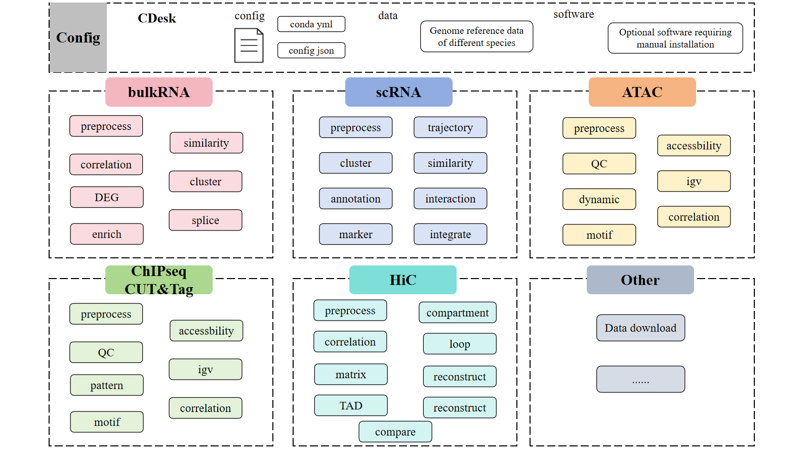

# CDesk handbook{ingnore}
CDesk is an integrated multi-omics analysis pipeline designed for processing data from various sequencing-based assays, including RNA-seq, scRNA-seq, ATAC-seq, CUT&Tag, ChIP-seq, and Hi-C. It comprises multiple subcommands that cover a comprehensive range of analysis tasks, from raw sequencing data process to downstream various advanced functions. Dedicated conda environment YAML files are supplied. To install, simply create the Conda environment from thess files (some functions may require additional software) and prepare the necessary species-specific data. Once configured, users can perform the desired analyses by entering the corresponding command on the command line.

#### [0. Installation ](Installation.html)

#### [1. BulkRNA ](BulkRNA.html)
&emsp;&emsp;1.1 bulkRNA: Preprocess
&emsp;&emsp;1.2 bulkRNA: Correlation
&emsp;&emsp;1.3 bulkRNA: DEG
&emsp;&emsp;1.4 bulkRNA: Enrich
&emsp;&emsp;1.5 bulkRNA: Similarity
&emsp;&emsp;1.6 bulkRNA: Clustering
&emsp;&emsp;1.7 bulkRNA: Splice

#### [2. scRNA ](scRNA.html)

#### [3. ATAC ](ATAC.html)

#### [4. ChIPseq&CUTTag ](ChIPseq&CUTTag.html)

#### [5. HiC ](HiC.html)
&emsp;&emsp;5.1 HiC: Preprocess
&emsp;&emsp;5.2 HiC: Sample Correlation
&emsp;&emsp;5.3 HiC: Matrix balancing and Format transformation
&emsp;&emsp;5.4 HiC: TAD
&emsp;&emsp;5.5 HiC: Compartment
&emsp;&emsp;5.6 HiC: Loop
&emsp;&emsp;5.7 HiC: 3D reconstruction
&emsp;&emsp;5.8 HiC: Distance-contact
&emsp;&emsp;5.9 HiC: Contact compare